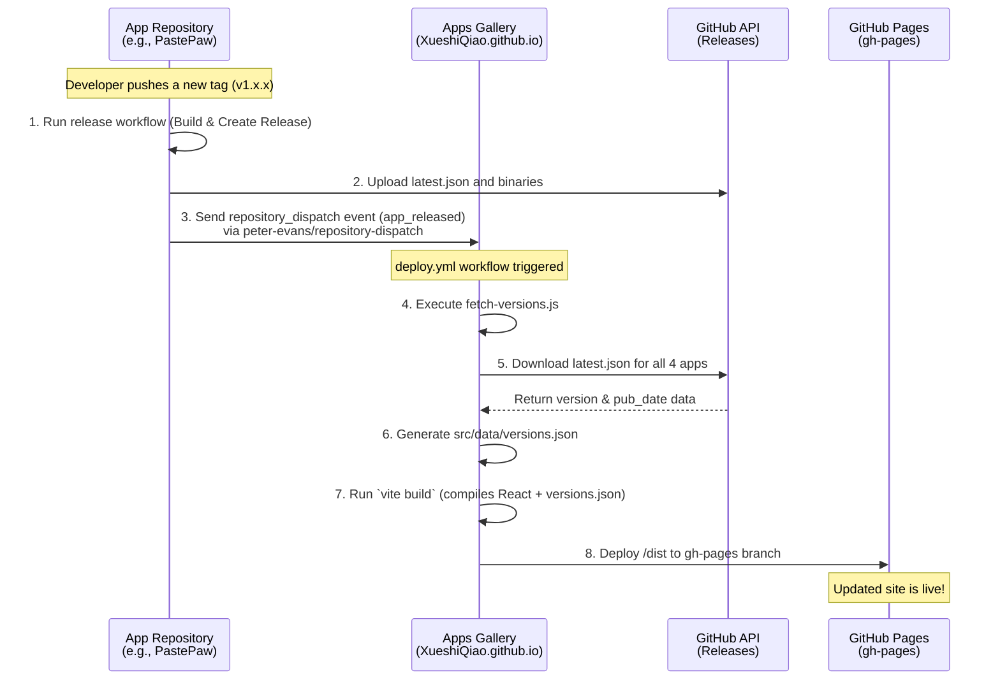

# Apps Gallery Automation Pipeline

This document outlines the cross-repository automation pipeline designed to keep the `apps_gallery` automatically updated with the latest releases of the applications it showcases.

## Overview

The `apps_gallery` repository (hosted at `XueshiQiao.github.io`) serves as a central hub for four distinct applications:
- **PastePaw**
- **Netstat Cat**
- **HyperCapslock**
- **Notifier**

To avoid manually updating the gallery whenever a new version of these applications is released, a GitHub Actions-based pipeline automatically fetches and displays the latest version information on the website.

## Pipeline Logic

The automation pipeline consists of three main components:

1. **Triggering the Update (App Repositories):**
   Each of the four application repositories contains a GitHub Actions release workflow. At the successful completion of a release build, the workflow uses a Fine-grained Personal Access Token (PAT) with `Contents: Read and write` permissions to dispatch a custom `repository_dispatch` event (named `app_released`) to the `apps_gallery` repository.

2. **Fetching Version Data (Apps Gallery Repository):**
   The `apps_gallery` project includes a Node.js script (`scripts/fetch-versions.js`). During the build process, this script parses the static application configurations in `src/data/apps.ts` to find the URLs for the `latest.json` files generated by the GitHub releases of each app. It then downloads these files (using `curl` to handle redirects seamlessly), extracts the `version` and `pubDate`, and saves the structured data to `src/data/versions.json`.

3. **Building and Deploying (Apps Gallery Repository):**
   The `apps_gallery` contains a deployment workflow (`.github/workflows/deploy.yml`) that listens for the `app_released` event (as well as standard pushes to the `main` branch). When triggered, it runs the standard Vite build process—which automatically executes the data-fetching script first—and then deploys the newly generated static site to the `gh-pages` branch.

## System Architecture

The following Mermaid sequence diagram visualizes the interaction between the repositories and the build process.

## Security & Secrets

This architecture relies on cross-repository communication. Because standard GitHub Action `GITHUB_TOKEN` credentials cannot trigger workflows in other repositories, a **Fine-grained Personal Access Token** is required.

- **Secret Name**: `GALLERY_UPDATE_PAT`
- **Required Permissions**: `Contents: Read and write` on the target `XueshiQiao/XueshiQiao.github.io` repository.
- **Location**: Must be stored as an Action Secret in `PastePaw`, `netstat-cat`, `HyperCapslock`, and `Notifier`.
